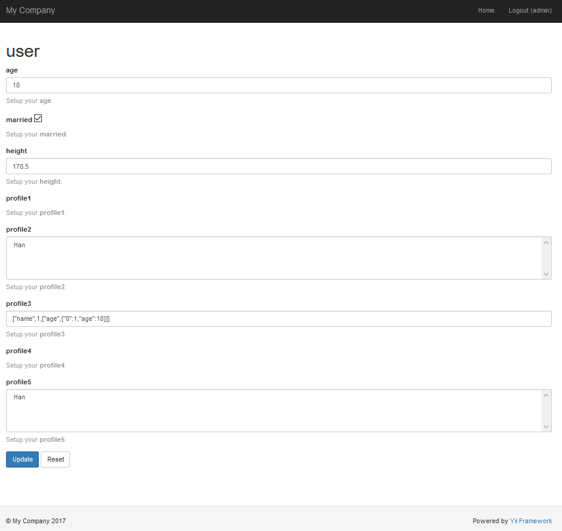

# Yii2 Setting release version 1.1.1 (FIX# i18n:long text translation)

Simple and efficient setup. All settings are read from DB or cache into a **static array** at frontend. Updates specified setting category at backend.

[](https://packagist.org/packages/yongtiger/yii2-setting)
[](https://packagist.org/packages/yongtiger/yii2-setting) 
[](https://packagist.org/packages/yongtiger/yii2-setting)
[](https://packagist.org/packages/yongtiger/yii2-setting)


## FEATURES

* frontend and backend codes completely **separated**
* settings **pre-stored** in DB
* **categorized** settings
* simple API for frontend read
* displaying all setting items of the specified category by **URL route**
* displaying a setting item according to the specified **input field type**


## DEPENDENCES


## INSTALLATION   

The preferred way to install this extension is through [composer](http://getcomposer.org/download/).

Either run

```
php composer.phar require --prefer-dist yongtiger/yii2-setting "*"
```

or add

```json
"yongtiger/yii2-setting": "*"
```

to the require section of your composer.json.


## CONFIGURATION


### Database migrations and customize settings

Before usage this extension, you need to prepare the database.


####    1. Create setting table

```
php yii migrate --migrationPath=@vendor/yongtiger/yii2-setting/src/migrations
```


####    2. Customize settings

You need to modify the records in the setting table by any SQL query tools, such as *phpmysqladmin*.

> Refer to `demo settings in DB` and [`Usages`](#usage-in-frontend).


### Backend setup

####    1. Module setup 

To access the module in backend, you need to configure the `modules` array in your application configuration:

```php
'modules' => [
    // ...
    'setting' => [
        'class' => 'yongtiger\setting\Module',
    ],
    // ...
],
```


####    2. Internationalization setup (optional)

All text and messages introduced in this extension **(NOT include the settings in DB!)** are translatable under category: 

```php
'extensions/yongtiger/yii2-setting/*'
```

And the default basePath is `'@vendor/yongtiger/yii2-setting/src/messages'`.

If you want to custumize your own translations, using following application configuration:

```php
return [
    'components' => [
        'i18n' => [
            'translations' => [
                'extensions/yongtiger/yii2-setting/*' => [
                    'class' => 'yii\i18n\PhpMessageSource',
                    'sourceLanguage' => 'en-US',
                    'basePath' => '<your custumized message path>',    ///custumize your own translations
                    'fileMap' => [
                        'extensions/yongtiger/yii2-setting/setting' => 'settings.php',
                    ],
                ],
                // ...
            ],
        ],
        // ...
    ],
    // ...
];
```

## USAGE IN FRONTEND

> Note: Only `category`, `key`, `value` and `type` fields in the setting table are used in the frontend.

Use function `Setting::get($category, $key, $default = null)` to get a setting directly (no need frontend setup):

```php
$mySetting = \yongtiger\setting\Setting::get('site', 'name');
``` 

The return value has been automatically converted to the type defined in the `setting type`.

See more about `setting type`:

- [`Using basic setting type`](docs/using-basic-setting-type.md)

- [`Using array setting type`](docs/using-array-setting-type.md)

- [`Using object setting type`](docs/using-object-setting-type.md)


### Using default value

```php
///Default value
$mySetting = \yongtiger\setting\Setting::get('not-exist-category', 'not-exist-name', 'default-value');
///Return 'default-value' if no exist setting category or key
```

> Note: It is recommended that `default value` be set to define the type in the `setting type`.


### Using setting array

In frontend, while getting any setting for the first time, all settings are read from DB or cache into a **static array**. Later, you can read a setting from the **static array**.

```php
$mySettingArray = \yongtiger\setting\Setting::setting;  ///get the current setting array

\yongtiger\setting\Setting::setting = $mySettingArray;  ///dynamically set a setting array
```


### Using caching:

Default caching is enabled.

Sometimes you need to disable the cache (e.g. in testing):

```php
\yongtiger\setting\Setting::enableCaching = false;  ///disable caching
$mySetting = \yongtiger\setting\Setting::get('site', 'name');
``` 


## USAGE IN BACKEND

You can access or update setting page by given the specified `category`:

```php
http://<path-to>/index.php?r=setting/default/update&category=<category>
```



See more advanced settings:

- [`Using input field type`](docs/using-input-field-type.md)

- [`Using items and options`](docs/using-items-and-options.md)

- [`Using label and labelOptions`](docs/using-label-and-labeloptions.md)

- [`Using hint and hintOptions`](docs/using-hint-and-hintoptions.md)


## TODO


## [Development roadmap](docs/development-roadmap.md)


## LICENSE 
**Yii2-setting** is released under the MIT license, see [LICENSE](https://opensource.org/licenses/MIT) file for details.
